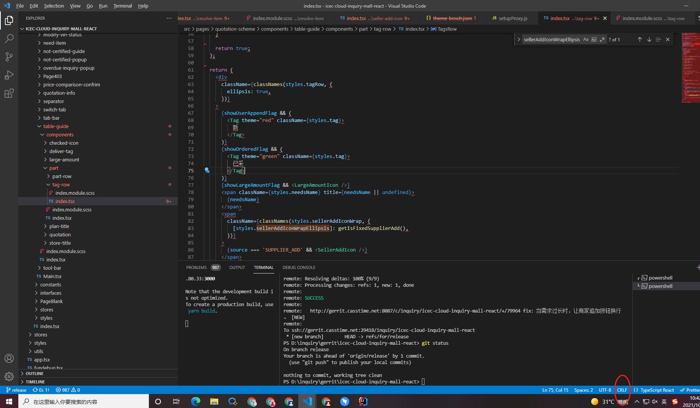

1、如果项目本身是LF格式的，拉下来就变成了CRLF格式的，可以使用以下命令。
```bash
git config --global core.autocrlf false
```

2、其他命令
```bash
// 提交时转换为LF，检出时转换为CRLF
git config --global core.autocrlf true  
 
// 提交时转换为LF，检出时不转换
git config --global core.autocrlf input  
 
// 提交检出均不转换
git config --global core.autocrlf false
```

