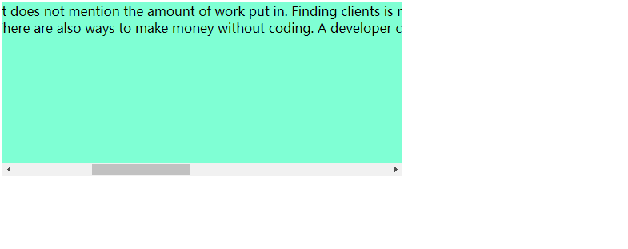

关键点：
1、当元素有横向滚动条时才执行
2、滚动时需要把页面的滚动事件禁掉，否则就会带着页面一起滚动

效果：


源码：
```html
<!DOCTYPE html>
<html lang="en">
<head>
  <meta charset="UTF-8">
  <meta name="viewport" content="width=device-width, initial-scale=1.0">
  <title>Document</title>
  <style type="text/css">
    .box{
      max-width: 500px;
      overflow-x: auto;
    }
    .inner{
      width: 1900px;
      height: 200px;
      background-color: aquamarine;
    }
    .html-overflow-y{
      overflow-y: hidden;
      padding-right: 12px;
    }
  </style>
</head>
<body>
  <div class="box">
    <div class="inner">
      Easier said than done. While these are good ideas it does not mention the amount of work put in. Finding clients is not easy and not even counting the time to research and vet a client. The time it takes to do a project can vary.
      I spend more time networking and finding leads than the actual job.
      There are also ways to make money without coding. A developer can have a side hustle that is not tech related. Being a dev 24/7 is going to lead to burnout.
    </div>
  </div>
  <script type="text/javascript">
    function isScrollExist (container){
        if(!container){
            return ({
                x:false,
                y:false,
                clientWidth:0,
                scrollWidth:0
            });
        }

        var scrollWidth = container.scrollWidth;
        var clientWidth = container.clientWidth;
        /** 是否存在X滚动条 */
        var hasScrollX = scrollWidth > clientWidth;
        /** 是否存在Y滚动条 */
        var hasScrollY = container.scrollHeight > container.clientHeight;

        return ({
            x:hasScrollX,
            y:hasScrollY,
            scrollWidth,
            clientWidth
        });
    }
    var box = document.querySelector(".box");
    box.addEventListener("mousewheel",function(e){
      var scrollContainer = e.currentTarget;
      var scrollObj = isScrollExist(e.currentTarget);

      var scrollWidth = scrollObj.scrollWidth;
      var clientWidth = scrollObj.clientWidth;

      if(!scrollObj.x  ||  scrollObj.y){
          return;
      }

      var isUp = e.wheelDelta /120 > 0;

      /** 存在横向滚动条，不存在纵向滚动条 */
      var scrollLeft =  scrollContainer.scrollLeft || 0;
      if (isUp) {
          scrollContainer.scrollLeft = Math.max(scrollLeft - 30,0);
      } else {
          scrollContainer.scrollLeft = Math.min(scrollLeft + 30,scrollWidth - clientWidth);
      }
    });
    box.addEventListener("mouseenter",function(e){
        /** 
         * 只有把body的overflow hidden掉，才能使得浮窗在滚动时页面不滚动
         * paddingRight是为了防止body的滚动条消失时页面抖动
         */
        var scrollObj = isScrollExist(e.currentTarget);

        if(scrollObj.x || scrollObj.y){
            /** 设置12px的paddingRight，防止滚动条去掉很突兀 */
            document.documentElement.classList.add("html-overflow-y");
        }
    });

    box.addEventListener("mouseleave",function(e){
      document.documentElement.classList.remove("html-overflow-y");
    });
  </script>
</body>
</html>
```